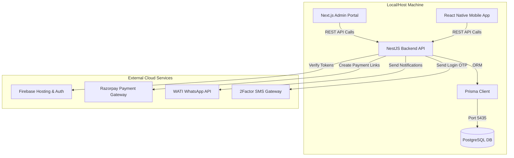

# SAJ Payment Collection & Follow-up System: Architecture & Directory Map

This document outlines the project structure, components, and external connections (Database, SMS, WhatsApp, Payments, Hosting, etc.) to make the system easy to understand and navigate.

---

## 1. Directory Structure

The repository is organized into three major folders (Modules) and root configurations:

```text
SAJ-Payment-followup/
├── backend/                  # NestJS REST API Server (Business Logic)
│   ├── src/                  # Application source code
│   │   ├── modules/          # Business modules (auth, customers, invoices, survey-works, integrations)
│   │   └── common/           # Shared guards, decorators, and interceptors
│   ├── prisma/               # Database Schema and migrations definitions
│   └── .env                  # Backend Configuration & API Keys (Database, Razorpay, SMS, WhatsApp)
│
├── admin-portal/             # Next.js Web Application (Management Dashboard)
│   ├── src/                  # Frontend pages, components, and state logic
│   └── out/                  # Compiled static build ready for deployment
│
├── mobile-app/               # React Native Expo Mobile App (Used by on-site staff)
│   ├── App.tsx               # Main entry point and screen routing
│   └── app.json              # Expo configuration (app metadata, versioning, package name)
│
├── firebase.json             # Firebase deployment configuration
└── .firebaserc               # Active Firebase project mapping
```

---

## 2. External Connections & Integrations

The system connects to several external services. Here is where they are defined and how they are used:



### 🗄️ Database (PostgreSQL)
*   **Purpose**: Stores users, company settings, clients/customers, invoices, payment history, and reminder logs.
*   **Where it is defined**:
    *   Prisma schema: [`backend/prisma/schema.prisma`](file:///a:/SAJ%20Technologies%20Pvt%20Ltd/SAJ-Payment%20fowlloup%20APK/backend/prisma/schema.prisma)
    *   Connection URL: Configured via `DATABASE_URL` in [`backend/.env`](file:///a:/SAJ%20Technologies%20Pvt%20Ltd/SAJ-Payment%20fowlloup%20APK/backend/.env) (currently running on port `5435`).

### 📱 SMS Gateway (2Factor API)
*   **Purpose**: Sends One-Time Passwords (OTPs) to users attempting to log in on the Mobile App.
*   **Where it is defined**:
    *   Code implementation: [`backend/src/modules/integrations/sms.service.ts`](file:///a:/SAJ%20Technologies%20Pvt%20Ltd/SAJ-Payment%20fowlloup%20APK/backend/src/modules/integrations/sms.service.ts)
    *   API Credentials: `TWO_FACTOR_API_KEY`, `TWO_FACTOR_SENDER_ID`, and `TWO_FACTOR_TEMPLATE_NAME` in [`backend/.env`](file:///a:/SAJ%20Technologies%20Pvt%20Ltd/SAJ-Payment%20fowlloup%20APK/backend/.env).

### 💬 WhatsApp Integration (WATI API)
*   **Purpose**: Dispatches automated payment links and gentle billing reminders directly to clients' WhatsApp numbers.
*   **Where it is defined**:
    *   Code implementation: [`backend/src/modules/integrations/wati.service.ts`](file:///a:/SAJ%20Technologies%20Pvt%20Ltd/SAJ-Payment%20fowlloup%20APK/backend/src/modules/integrations/wati.service.ts)
    *   API Credentials: `WATI_API_ENDPOINT` and `WATI_API_TOKEN` in [`backend/.env`](file:///a:/SAJ%20Technologies%20Pvt%20Ltd/SAJ-Payment%20fowlloup%20APK/backend/.env).

### 💳 Payment Gateway (Razorpay)
*   **Purpose**: Generates dynamic payment links for invoices and listens to webhook events when a customer completes a payment.
*   **Where it is defined**:
    *   Code implementation: [`backend/src/modules/integrations/razorpay.service.ts`](file:///a:/SAJ%20Technologies%20Pvt%20Ltd/SAJ-Payment%20fowlloup%20APK/backend/src/modules/integrations/razorpay.service.ts)
    *   Webhook controller: [`backend/src/modules/webhooks/webhooks.controller.ts`](file:///a:/SAJ%20Technologies%20Pvt%20Ltd/SAJ-Payment%20fowlloup%20APK/backend/src/modules/webhooks/webhooks.controller.ts)
    *   API Credentials: `RAZORPAY_KEY_ID`, `RAZORPAY_KEY_SECRET`, and `RAZORPAY_WEBHOOK_SECRET` in [`backend/.env`](file:///a:/SAJ%20Technologies%20Pvt%20Ltd/SAJ-Payment%20fowlloup%20APK/backend/.env).

### 🔥 Hosting & Authentication (Firebase)
*   **Purpose**: Firebase Hosting is used to serve the Next.js Admin Portal. Firebase Auth IDs are used for user validation.
*   **Where it is defined**:
    *   Hosting config: [`firebase.json`](file:///a:/SAJ%20Technologies%20Pvt%20Ltd/SAJ-Payment%20fowlloup%20APK/firebase.json) & [`.firebaserc`](file:///a:/SAJ%20Technologies%20Pvt%20Ltd/SAJ-Payment%20fowlloup%20APK/.firebaserc) (targeting project `lucky-processor-500115-v0`).
    *   Authentication: Backend auth verification checks `FIREBASE_PROJECT_ID` in [`backend/.env`](file:///a:/SAJ%20Technologies%20Pvt%20Ltd/SAJ-Payment%20fowlloup%20APK/backend/.env).

---

## 3. Development Workflow

To start everything locally:
1. **Start Database**: Ensure Docker Desktop is running and start the database container `saj-postgres`.
2. **Start Backend**: Run `npm run start:dev` inside the `backend` directory.
3. **Start Admin Portal**: Run `npm run dev` inside the `admin-portal` directory.
4. **Start Mobile App**: Run `npx expo start` inside the `mobile-app` directory.
